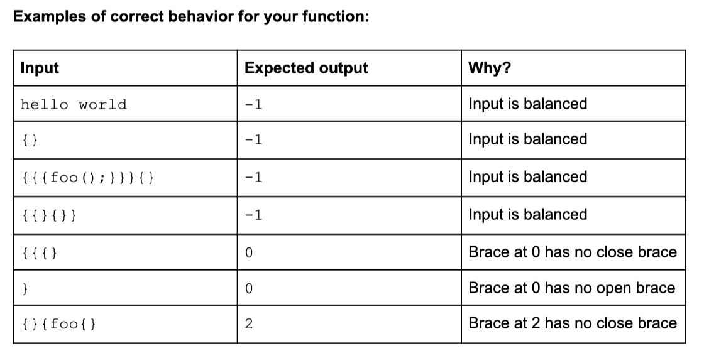

# balancer_function

Background: A​​balanced ​​pair​ ​of ​​braces ​​is​​ one​​ open​​ brace​​ (​“{“​)​​followed​​ by​​ one​​ close​​ brace​​(​“}“​)​​with ​​zero or​​ more​​ balanced​​ pairs ​​of​​ braces ​​between​​ them. A ​​string​​ is ​​said​​ to be​​ “balanced”​​if​​ it​​ consists​​ of​​ zero​​ or​​ more ​​balanced​​ pairs​​ of ​​braces.​​A balanced​​ string​​ can ​​also​​ contain​​ other​​ arbitrary ​​characters​​ (which​​ are​​ not​​ relevant ​​to​​ its “balanced”​​ property).

Assignment: Write​​ a​​ function​​ that​​ takes ​​a​​ string​​ and​​ returns ​​the​​ index ​​of​​ the ​​first​​ brace​​ that​​ breaks ​​its​​ balance(or​​ returns​​ the special​​ value​​​ -1​​​ if​​ the ​​string​ ​is ​​balanced).​​The ​​first​​ brace​​ that ​​breaks​​ the​​ balance is​​ the​​ brace ​​closest​​ to​​ the​​ start​​ of​​ the​​ string​​ that ​​isn’t​​ part​​ of ​​a​​ balanced​​ pair.Please ​​state​​ any​​ additional​​ assumptions ​​you ​​make​​ and ​​try​​ to ​​make ​​your ​​function​ ​as ​​efficient ​​as you​ ​can. ​​For ​​extra​​cred it,​​write​ ​unit​ ​tests

